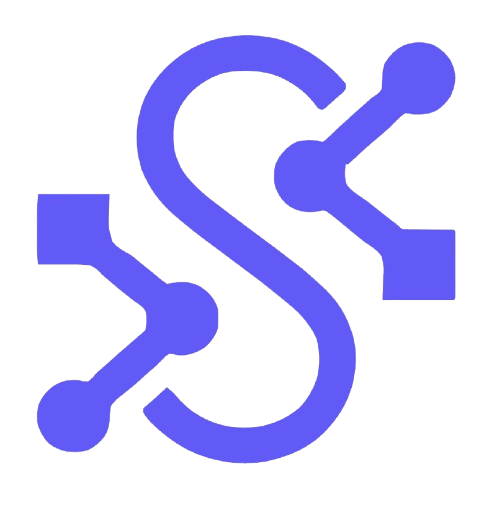

<p align="center">
  
</p>

# 🚀 Licita API - Backend SECOP III

Bienvenido al backend de **Licita API**, una plataforma avanzada de inteligencia artificial diseñada para revolucionar la forma en que las empresas encuentran y aplican a licitaciones públicas (SECOP). Este sistema utiliza tecnologías de vanguardia como **RAG (Retrieval-Augmented Generation)**, **Vector Search** y **LLMs (Large Language Models)** para realizar emparejamientos inteligentes entre el perfil de una empresa y las oportunidades de negocio disponibles.

---

## 🛠️ Stack Tecnológico

Este proyecto ha sido construido con un stack robusto y moderno, pensado para escalabilidad, rendimiento y facilidad de despliegue:

### Core & Backend
*   **Lenguaje**: Python 3.12+
*   **Framework Web**: [FastAPI](https://fastapi.tiangolo.com/) (Alto rendimiento, asíncrono, validación automática).
*   **ORM**: [SQLAlchemy 2.0](https://www.sqlalchemy.org/) (Manejo eficiente de base de datos).
*   **Validación de Datos**: [Pydantic v2](https://docs.pydantic.dev/).

### Base de Datos & Almacenamiento
*   **Base de Datos Relacional**: PostgreSQL 16.
*   **Vector Database**: **pgvector** (Extensión de Postgres para almacenamiento y búsqueda de embeddings vectoriales).
*   **Object Storage**: **MinIO** (Compatible con S3) para almacenamiento de documentos (PDFs, Anexos).

### Inteligencia Artificial (AI)
*   **Embeddings**: Google Gemini (`text-embedding-004`) para vectorización de perfiles y licitaciones.
*   **LLM**: Google Gemini Pro para análisis semántico, extracción de entidades y razonamiento avanzado.
*   **Orquestación**: LangChain (para flujos de RAG y procesamiento de documentos).

### Infraestructura & DevOps
*   **Contenerización**: Docker & Docker Compose.
*   **Servidor Web**: Uvicorn (ASGI).
*   **Seguridad**: JWT (JSON Web Tokens) para autenticación, Hashing de contraseñas con Bcrypt.

---

## 🏗️ Arquitectura y Características Clave

El sistema no es un simple CRUD; es un motor de recomendación inteligente.

1.  **Ingesta y Vectorización Automática**:
    *   Al registrar una empresa, el sistema genera automáticamente **embeddings** (vectores matemáticos) de su Razón Social y códigos CIIU.
    *   Esto permite que la empresa sea "buscable" semánticamente desde el primer momento.

2.  **Motor de Matching (RAG)**:
    *   **Match Inicial**: Búsqueda vectorial (similitud de coseno) para encontrar licitaciones semánticamente similares al perfil de la empresa.
    *   **Match Aumentado (AI)**: Un segundo paso donde un LLM evalúa los candidatos para filtrar falsos positivos y dar una explicación del porqué del match.

3.  **Análisis de Mercado**:
    *   Endpoints dedicados para analizar precios históricos y competencia en licitaciones similares.

---

## 🚀 Instalación y Despliegue

### Prerrequisitos
*   Docker y Docker Compose instalados.
*   Git.

### Pasos para ejecutar

1.  **Clonar el repositorio**:
    ```bash
    git clone <url-del-repo>
    cd Backend_Secop3
    ```

2.  **Configurar Variables de Entorno**:
    Crea un archivo `.env` en la raíz (basado en `.env.example` si existe) con tus credenciales:
    ```env
    DATABASE_URL=postgresql+psycopg://user:password@db:5432/licita_db
    GEMINI_API_KEY=tu_api_key_de_google
    S3_ACCESS_KEY=minioadmin
    S3_SECRET_KEY=minioadmin
    S3_BUCKET=licitacion-bucket
    ALLOWED_ORIGINS=http://localhost:3000
    ```

3.  **Levantar el entorno con Docker**:
    ```bash
    docker compose up -d --build
    ```
    *Esto iniciará la API, la Base de Datos (Postgres+pgvector), MinIO y PGAdmin.*

4.  **Acceder a la Documentación**:
    *   Swagger UI: [http://localhost:8000/docs](http://localhost:8000/docs)
    *   ReDoc: [http://localhost:8000/redoc](http://localhost:8000/redoc)

---

## 📡 Documentación de Endpoints

A continuación se detallan los endpoints principales y sus resultados esperados.

### 🔐 Autenticación (`/api/v1/auth`)

| Método | Endpoint | Descripción | Resultado Esperado |
| :--- | :--- | :--- | :--- |
| `POST` | `/login` | Iniciar sesión y obtener token. | `200 OK`: `{ "access_token": "...", "token_type": "bearer" }` |
| `POST` | `/register` | Registrar nuevo usuario. **Nota**: Valida NIT en `companies` y genera embeddings si faltan. | `200 OK`: Objeto Usuario creado. |

### 🏢 Empresas (`/api/v1/empresas`)

| Método | Endpoint | Descripción | Resultado Esperado |
| :--- | :--- | :--- | :--- |
| `GET` | `/` | Listar empresas registradas. | `200 OK`: Lista de objetos Empresa. |
| `POST` | `/` | Crear una nueva empresa manualmente. | `201 Created`: Objeto Empresa creado. |
| `GET` | `/{nit}` | Obtener detalles de una empresa por NIT. | `200 OK`: Detalles de la empresa. |
| `PUT` | `/{nit}` | Actualizar datos de una empresa. | `200 OK`: Empresa actualizada. |

### 🎯 Oportunidades & Matching (`/api/v1/opportunities`)

Este es el núcleo de la inteligencia del sistema.

| Método | Endpoint | Descripción | Resultado Esperado |
| :--- | :--- | :--- | :--- |
| `GET` | `/{nit}/match` | **Match Básico**. Busca licitaciones por similitud vectorial con el perfil de la empresa. | `200 OK`: Lista de licitaciones con `score` de similitud (0-1). |
| `GET` | `/{nit}/match-ai` | **Match Aumentado**. Usa LLM para re-evaluar y filtrar los mejores matches. | `200 OK`: Lista refinada de licitaciones con justificación de IA. |
| `GET` | `/{nit}/market-analysis` | **Análisis de Mercado**. Estadísticas de precios de licitaciones similares. | `200 OK`: `{ "min_price": ..., "max_price": ..., "avg": ... }` |
| `GET` | `/{nit}/company` | Info rápida de la empresa y estado de sus embeddings. | `200 OK`: `{ "nit": "...", "has_embedding": true }` |

### 📄 Licitaciones (`/api/v1/licitaciones`)

| Método | Endpoint | Descripción | Resultado Esperado |
| :--- | :--- | :--- | :--- |
| `GET` | `/search` | Búsqueda de texto completo en licitaciones. | `200 OK`: Lista de licitaciones que coinciden con la query. |
| `POST` | `/` | Crear/Ingestar una nueva licitación. | `200 OK`: Licitación creada. |
| `GET` | `/{id}` | Ver detalle de una licitación. | `200 OK`: Objeto Licitación completo. |

### ⚙️ Pipelines (`/api/v1/pipelines`)

| Método | Endpoint | Descripción | Resultado Esperado |
| :--- | :--- | :--- | :--- |
| `POST` | `/run/{id}` | Ejecutar flujo de procesamiento (ETL/AI) para una licitación específica. | `200 OK`: Resultado del procesamiento. |
| `POST` | `/batch` | Ejecutar procesamiento masivo. | `200 OK`: Estado del job batch. |

### ☁️ Almacenamiento (`/api/v1/storage`)

| Método | Endpoint | Descripción | Resultado Esperado |
| :--- | :--- | :--- | :--- |
| `POST` | `/upload` | Subir archivo a MinIO (S3). | `200 OK`: `{ "s3_key": "..." }` |
| `GET` | `/url/{path}` | Generar URL firmada para descarga segura. | `200 OK`: `{ "url": "http://minio..." }` |

---

## 📂 Estructura del Proyecto

```
Backend_Secop3/
├── app/
│   ├── api/            # Routers y Endpoints (Controladores)
│   ├── core/           # Configuración, Seguridad, CORS
│   ├── db/             # Conexión a Base de Datos y Sesiones
│   ├── models/         # Modelos SQLAlchemy (Tablas)
│   ├── schemas/        # Esquemas Pydantic (Validación Request/Response)
│   ├── services/       # Lógica de Negocio (Auth, Matching, AI)
│   └── main.py         # Punto de entrada de la aplicación
├── Dockerfile          # Definición de imagen Docker
├── docker-compose.yml  # Orquestación de servicios
└── requirements.txt    # Dependencias de Python
```

---
*Desarrollado con ❤️ por el equipo de Licita API.*

---
<p align="center">
  
</p>
